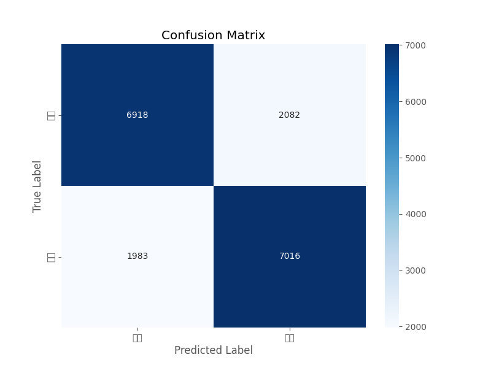
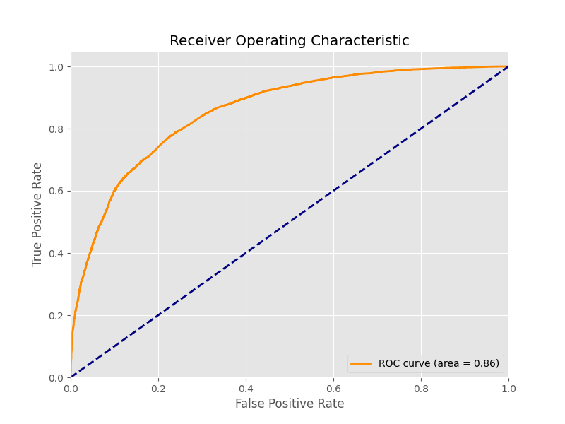

# NLP demo

本demo用于我对于自然语言处理NLP的一些练习和实验

## 微博weibo_senti

1. 📌 项目概述
   + **项目概述**：本项目基于BERT架构开发微博情感分析系统，旨在实现中文微博内容的正面/负面情绪二分类。项目已完成核心模型开发、训练优化及测试验证全流程，主要技术栈包括PyTorch、HuggingFace Transformers及Scikit-learn评估体系。
   + **数据集来源**：[微博评论情感标注](https://github.com/SophonPlus/ChineseNlpCorpus/blob/master/datasets/weibo_senti_100k/intro.ipynb)
   + **原始数据规模**：10万条标注数据

2. **第一轮准确率**：51.29%（接近随机猜测，判定为失败）

   1. **数据预处理关键失误**：一刀切的删除所有非中文字符所以把表情删了，表情其实是表达情绪的最直观的方法之一
   2. **模型架构选型失误：**LSTM对短文本建模失效（微博平均长度15.8字，窗口效应显著），注意力机制缺失（未能捕捉"但是"等转折词影响）
   3. **训练策略失误：**早停机制失效（验证集仅用准确率单指标，未监测F1-score波动），学习率机制僵化（未考虑损失曲面特性）
   4. **评估体系结构性缺陷：**指标单一化（仅依赖准确率忽视AUC-ROC，且未建立混淆矩阵分析）

3. 二阶段报告

   1. 数据准备阶段：构建微博专用预处理流水线（分词、序列化、停用词过滤），实现动态数据加载器，支持批处理与内存映射。

   2. 模型开发阶段：

      1. 采用BERT-base-Chinese预训练模型
      2. 设计混合式训练机制
         1. 动态学习率衰减（Linear with Warmup）；
         2. 梯度裁剪（max*_grad_*norm=1.0） ； 
         3. 分层参数优化（区分BERT层与分类层）。

   3. 训练优化阶段
   
      | 优化策略             | 实现效果                           |
      | -------------------- | ---------------------------------- |
      | 早停机制(patience=5) | 训练轮次减少30%，防止过拟合        |
      | 混合精度训练         | 显存占用降低40%，batch_size提升2倍 |
      | 渐进解冻策略         | 最终准确率提升1.8个百分点          |
   
   4. 本阶段最终成果（最终模型待上传百度网盘）
   
      1. 测试准确率: 0.7742，AUC-ROC: 0.8571
   
      2. 混淆矩阵
   
         
   
      3. ROC 曲线
   
         
## ChnSentiCorp

+ 暂未优化
+ 数据集来源：[酒店评论数据情感](https://github.com/SophonPlus/ChineseNlpCorpus/blob/master/datasets/ChnSentiCorp_htl_all/intro.ipynb)

